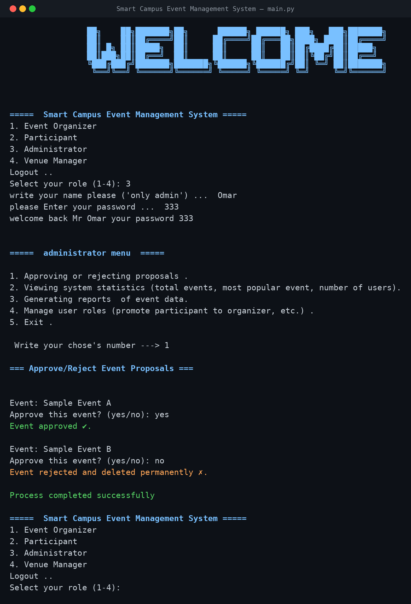
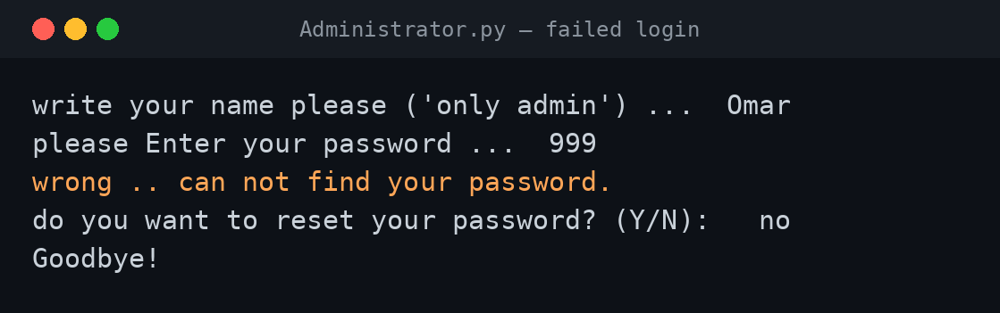
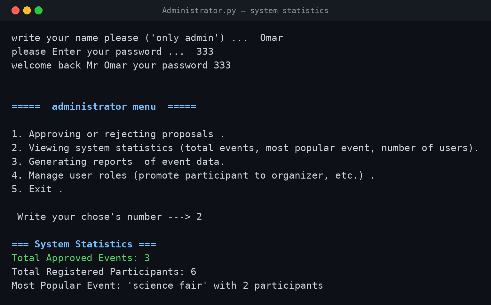
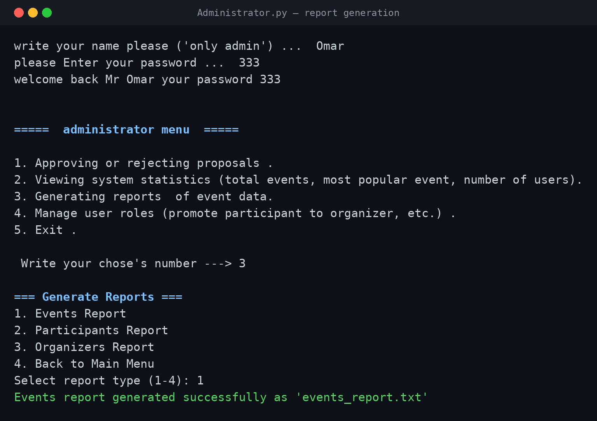

# Smart Campus Event Management System — Python

A menu-driven console application for managing campus events end to end: organizers create events, participants register, an administrator approves them and generates reports, and a venue manager handles bookings. All data is stored in plain text files, with no database or external libraries.



| | |
|---|---|
| **Project type** | University group project — *Introduction to Programming with Python* |
| **Team** | 4 members |
| **My role** | Team Leader — I wrote the **main menu**, the **login module** used by all four roles, and the **Administrator module** |
| **Tools** | Python 3 (standard library only), file-based storage |
| **Scale** | 6 modules · ~1,060 lines of Python · 11 data files |

---

## The System

Four roles, each with its own module and menu:

| Role | What it can do |
|---|---|
| **Event Organizer** | Create, update and cancel events; view who registered |
| **Participant** | Browse events, register, cancel a registration, view other participants |
| **Administrator** | Approve or reject event proposals, view system statistics, generate reports, promote or demote users |
| **Venue Manager** | View upcoming events, mark venues unavailable, approve or reject booking requests, suggest alternative venues |

Everything is saved to text files (`events.txt`, `participants.txt`, `organizers.txt`, `venues.txt`, …), so data survives between runs without a database.

---

## My Contribution

### 1. `main.py` — entry point and role menu

The welcome banner and the menu that loads the module for the chosen role.

```python
def main_menu():
    while True :
     print("\n=====  Smart Campus Event Management System =====")
     print("1. Event Organizer")
     print("2. Participant")
     print("3. Administrator")
     print("4. Venue Manager")
     role = int(input("Select your role (1-4): "))
     if role == 1:
        import event_organizer
     elif role == 2:
        import participant
     elif role == 3:
        import Administrator
     elif role == 4:
        import VenueManager
```

### 2. `password.py` — the login module

Checks the username without caring about upper or lower case, verifies the password, and offers a reset when it doesn't match. The other three role modules reuse this same login gate.

```python
admin = None
for admin_name in admins.keys():
    if admin_name.lower() == user.lower():
        admin = admin_name
        break

if admin:
    password = int(input("please Enter your password ...  "))

    if password == admins[admin]:
        print(f"welcome back Mr {admin} \n")
    elif password != admins[admin]:
        print("wrong .. can not find your password.")
        qu2 = input("do you want to reset your password? (Y/N):   ").lower().strip()
else:
    print("\nAccess denied. You are not an authorized admin.")
```



### 3. `Administrator.py` — the admin module

**Approve or reject proposals** — reads the pending events, asks for a decision on each one and writes the approved ones to `Approved_events.txt`:

```python
if ques in ["y", "yes"]:
    approved_events.append(event)
    print("Event approved ✅.")
else:
    print("Event rejected and deleted permanently ❌.")

if approved_events:
    with open(approved_file, "a") as file:
        for event in approved_events:
            file.write(event + "\n")
```

**System statistics** — counts events and participants, and works out the most popular event by counting registrations per event with a dictionary:

```python
event_participants = {}
with open("participants.txt", "r") as file:
    for line in file:
        if ',' in line:
            event_name = line.split(',')[0].strip()
            event_participants[event_name] = event_participants.get(event_name, 0) + 1

if event_participants:
    most_popular = max(event_participants.items(), key=lambda x: x[1])
    print(f"Most Popular Event: '{most_popular[0]}' with {most_popular[1]} participants")
```



**Report generation** — writes events, participants and organizer reports out to their own `.txt` files:



**User role management** — promotes a participant to organizer (or demotes them back) by moving the name between files:

```python
# Remove from participants
with open("participants.txt", "w", encoding="utf-8") as file:
    for name in participants:
        if name != username:  # write only the names that do not match with the input
            file.write(name + "\n")

# Add to organizers
with open("organizers.txt", "a", encoding="utf-8") as file:
    file.write(username + "\n")

print(f"Successfully promoted {username} to organizer ✅ ")
```

Every file operation is wrapped in error handling for missing files, permission errors and unexpected failures. A longer text version of these runs is in [`docs/sample-session.md`](docs/sample-session.md).

---

## Running It

Requires Python 3 — nothing to install.

```bash
cd src
python main.py
```

Then pick a role (1–4). The demo admin accounts are in the code: user `Omar` with password `333`.

To run only the admin module:

```bash
cd src
python Administrator.py
```

---

## Code Review — What I'd Fix

Going back over the submitted code, these are the problems I would fix, and how:

| # | Issue | Why it matters | Fix |
|---|---|---|---|
| 1 | Usernames and passwords are **written directly in the code**, and the same block is copy-pasted into all four modules | Anyone who reads the source sees every password, and a change has to be made in four places | Move the login into one module that the others import, and keep credentials outside the code |
| 2 | Passwords are stored as **plain numbers** and printed back to the screen after login | Passwords should never be readable, stored or displayed | Store a hash (`hashlib`/`bcrypt`), and read input with `getpass` so it isn't shown while typing |
| 3 | A password reset **never saves** — it only changes a dictionary in memory | The new password is gone the moment the program closes | Write credentials to a file (or database) so a reset actually persists |
| 4 | No limit on login attempts | Allows unlimited password guessing | Lock the account after a few failed attempts and log them |
| 5 | Menus use `int(input(...))` without checking | Typing a letter crashes the program with a `ValueError` | Validate the input, or wrap it in `try/except` |
| 6 | Modules are loaded with `import` inside the menu | Python only runs a module the first time it's imported, so picking the same role twice does nothing | Put the code in functions and call them |
| 7 | `participants.txt` is used with two different formats — `event,name` in one place and just `name` in another | Promoting a user silently fails to find them | Pick one format (or split it into two files) |
| 8 | `participant.py` reads capacity from column index 5, but events only have 5 columns (0–4) | Registering for an event crashes | Read column index 4 |
| 9 | Rejected events are dropped, but the pending file is rewritten from an empty list | Everything left over is deleted, not just the rejections | Add unreviewed events to `remaining_events` before rewriting the file |
| 10 | "Exit" in the admin menu calls the menu again instead of returning | You can never leave the menu normally | `return` from the function instead |

These are the kinds of issues I now look for first, especially the credential handling — storing and printing plain-text passwords is one of the most common real-world weaknesses.

## Repository Structure

```
campus-event-management-python/
├── src/
│   ├── main.py             # entry point and role menu          (mine)
│   ├── password.py         # login / password reset module      (mine)
│   ├── Administrator.py    # admin module                       (mine)
│   ├── event_organizer.py  # organizer module
│   ├── participant.py      # participant module
│   ├── VenueManager.py     # venue manager module
│   └── *.txt               # data files and generated reports
├── screenshots/            # program output
└── docs/
    └── sample-session.md   # example run of the admin module
```

## Skills Demonstrated

`Python` `File handling` `Exception handling` `Dictionaries & lists` `Menu-driven programs` `Modular design` `Authentication logic` `Secure coding review` `Team leadership`

## Team

- **Omar Mohammed Mahdi Mahdi** — Team Leader (main menu, login, administrator module)
- Tahmid Hasnat
- Muhammad Wijdan
- Muhammad Audry Shafi Irawan

---

*Academic project completed at Asia Pacific University of Technology & Innovation (APU), 2025. The sample data in the text files is fictional.*
